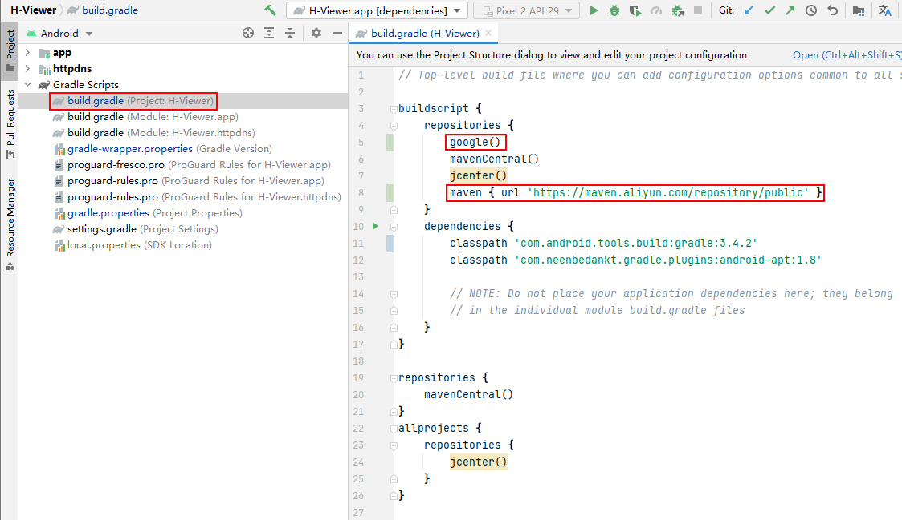

# H-Viewer

----

## Android Studio版本

> **ArcticFox | 2020.3.1 Patch 3**

## Build

### Android Gradle Plugin Version

> 3.4.2

### Gradle Version

> 5.1.1

### 配置信息

> build.gradle (Project)

```java
buildscript {
    google()
    ......
    // 可选
    maven { url 'https://maven.aliyun.com/repository/public' }
}

allprojects {
    google()
}
```



> build.grade

```java
// 可通过Project Structure修改
android {
    ......
    compileSdkVersion 28
    buildToolsVersion "28.0.3"
    ......
    defaultConfig {
        ......
        targetSdkVersion 28
        ......
    }
}

dependencies {
    ......
    def support_version = '28.0.0'
    implementation("com.android.support:support-v4:$support_version")
    implementation("com.android.support:appcompat-v7:$support_version")
    implementation("com.android.support:cardview-v7:$support_version")
    implementation("com.android.support:design:$support_version")
    ......
    implementation('com.github.vajro:MaterialDesignLibrary:1.6') {
        // 排除以下冲突项
        exclude group: 'com.android.support', module: 'support-v4'
    }
    ......
    //    implementation 'com.github.rengwuxian:MaterialEditText:2.1.4'
    implementation 'com.rengwuxian.materialedittext:library:2.1.4'
    ......
    //    implementation 'com.github.MiguelCatalan:MaterialSearchView:v1.4.0'
    implementation 'com.miguelcatalan:materialsearchview:1.4.0'
    ......
    // 冲突项
    //    implementation 'com.gu:option:1.3'
    ......
    // 缺少
    implementation 'io.reactivex:rxandroid:1.2.1'
    // Because RxAndroid releases are few and far between, it is recommended you also
    // explicitly depend on RxJava's latest version for bug fixes and new features.
    implementation 'io.reactivex:rxjava:1.3.8'
}

```

> gradle.properties [注释以下代码]

```java
#systemProp.https.proxyPort=1080
#systemProp.http.proxyHost=localhost
#org.gradle.jvmargs=-Xmx2048m
#systemProp.https.proxyHost=localhost
#org.gradle.parallel=true
#systemProp.http.proxyPort=1080
```

> local.properties [本地生成，添加以下代码]

```java
storeFile=D\:\\Document\\Coding\\Coding_2021\\Github\\manhua\\H-Viewer_2020\\key.jks
storePassword=123456
keyAlias=key0
keyPassword=123456
```

> QRCodeUtil.java

```java
    canvas.save();
//       canvas.save(Canvas.ALL_SAVE_FLAG);
```

> 运行，存在BUG

## 修改1

> 更新
>
> Update compile to implementation
> Update androidTestCompile to androidTestImplementation
> Update testCompile to testImplementation  
>
> 运行，存在BUG

## 修改2

**BUG**: 点击侧栏中【设置】，app闪退

**分析**：Directory Chooser库导致
**处理**：用其他库，如[MaterialFilePicker
](https://github.com/nbsp-team/MaterialFilePicker)取代

Min SDK Version
17 => 19

添加依赖

```java
repositories {
    jcenter()
}

dependencies {
    implementation 'com.nbsp:materialfilepicker:1.9.1'
}
```

需要升级到AndroidX


